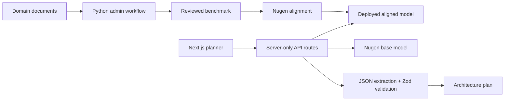

# DomainFit

**Developer Use-Case Planner & Nugen Alignment Readiness Builder**

> From use case to tested alignment plan.

DomainFit helps developers decide whether an AI product needs a general model, domain alignment, retrieval-augmented generation, tools/MCP, or a hybrid architecture. It turns that decision into a validated architecture result, document-readiness assessment, editable benchmark plan, implementation sequence, and base-versus-aligned comparison.

## Why it exists

A general chatbot can suggest an architecture, but its advice is difficult to reuse or evaluate. DomainFit produces a strict structured artifact and applies a transparent decision framework:

- stable terminology, decision patterns, formats, and escalation behavior may benefit from alignment;
- changing or cited facts belong in retrieval;
- private/live data and external actions belong behind tools and permissions;
- calculations, authorization, schema checks, and approval gates remain deterministic;
- high-impact outcomes require appropriate human review.

DomainFit does not recommend alignment for every use case.

## Product workflow

1. Describe the use case, users, domain, runtime needs, risks, evidence, latency, and usage.
2. Receive a schema-validated architecture plan.
3. Review alignment, retrieval, tool, deterministic, and human-review responsibilities.
4. Assess source-document strengths and gaps.
5. Edit and export a benchmark plan.
6. Compare the Nugen base model with the deployed DomainFit aligned model on identical scenarios.

## Architecture



The public web application never exposes alignment or deployment operations. See [architecture details](docs/architecture.md).

## Nugen workflow

The local Python workflow follows the official [Nugen API documentation](https://docs.nugen.in) and [Nugen cookbook](https://github.com/nugen-in/nugen-cookbook):

```text
verify → prepare → upload → generate benchmark → review → upload benchmark
       → align → monitor → deploy → smoke test → compare
```

Every API call is centralized in `scripts/nugen/nugen_client.py`. Workflow IDs are saved atomically in ignored `artifacts/state.json`, allowing safe resume. Paid alignment and deployment require explicit confirmation flags.

Known API ambiguities and verification status are recorded in [Nugen API notes](docs/nugen-api-notes.md).

## Documents used for alignment

The repository currently contains scenario examples only. Final approved alignment documents should be added by the project owner after confirming ownership, effective dates, precedence, secrets/PII removal, and representative edge cases. DomainFit does not ship invented production policy documents as alignment evidence.

## Benchmark methodology

`benchmarks/held-out/domainfit-held-out.json` contains 15 scenarios spanning support, developer documentation, finance, legal information, healthcare workflow, internal knowledge, changing prices, live accounts, external actions, developer tools, structured classification, insufficient and conflicting documents, high-risk decisions, and a case where alignment is unnecessary.

Held-out scenarios must never be added to alignment documents. Comparisons use identical prompts and evaluate:

- architecture selection;
- responsibility separation;
- assumptions and unsupported claims;
- deterministic and human-review boundaries;
- benchmark quality and coverage.

Response length is not a quality metric.

## Base versus aligned results

Mock mode demonstrates the comparison interaction but is never presented as performance evidence. Authenticated evaluation outputs are written under ignored `evaluations/` so they can be reviewed before any aggregate result is published.

## Technology

- Next.js App Router, React, TypeScript, Tailwind CSS
- Zod, React Hook Form
- Python 3.11+, HTTPX, Pydantic, Tenacity
- Vitest and React Testing Library
- pytest and Ruff
- GitHub Actions

## Setup

Requirements: Node.js 20+, npm, and Python 3.11+.

```bash
cp .env.example .env.local
python3 -m venv .venv
.venv/bin/python -m pip install -e '.[dev]'
npm install
```

Start the web application:

```bash
npm run dev
```

Open `http://localhost:3000`. Mock mode is enabled by default and does not require an API key.

### Live inference configuration

Set server-side environment variables:

```env
NUGEN_API_KEY=
NUGEN_BASE_URL=https://api.nugen.in
NUGEN_BASE_MODEL=
NUGEN_ALIGNED_MODEL=
NUGEN_MOCK_MODE=false
NEXT_PUBLIC_APP_URL=
```

`NUGEN_API_KEY` must never use a `NEXT_PUBLIC_` prefix.

## Administrative commands

Verify the account and list alignment-ready models:

```bash
.venv/bin/python -m scripts.nugen.00_verify_account
```

Prepare local source documents:

```bash
.venv/bin/python -m scripts.nugen.01_prepare_dataset
```

Run through benchmark generation:

```bash
.venv/bin/python -m scripts.nugen.run_pipeline --through benchmark
```

Create and monitor an alignment only after review:

```bash
.venv/bin/python -m scripts.nugen.run_pipeline --confirm-align --through alignment
```

Deploy only after the alignment is ready:

```bash
.venv/bin/python -m scripts.nugen.run_pipeline --confirm-align --confirm-deploy --through deployment
```

Compare deployed models:

```bash
.venv/bin/python -m scripts.nugen.10_compare_models
```

## Validation

```bash
.venv/bin/python -m pytest tests/python
.venv/bin/python -m ruff check scripts tests
npm run lint
npm run typecheck
npm run test
npm run build
```

## Limitations

- Browser-local mock results are not shared across devices.
- The live Nugen multipart document and benchmark formats require an authenticated verification before use.
- Model output validation reduces integration risk but does not establish factual correctness or safety.
- Domain owners must review documents, benchmarks, and high-impact recommendations.
- No genuine base-versus-aligned improvement claim is made until held-out evaluation is complete.

## Future improvements

- Add authenticated Nugen observations and sanitized fixtures.
- Persist shareable results in a server-side store if product requirements justify it.
- Add rubric scoring and reviewer annotations to comparisons.
- Add accessible charts after genuine evaluation data exists.
- Add rate limiting and abuse controls before exposing live inference publicly.
