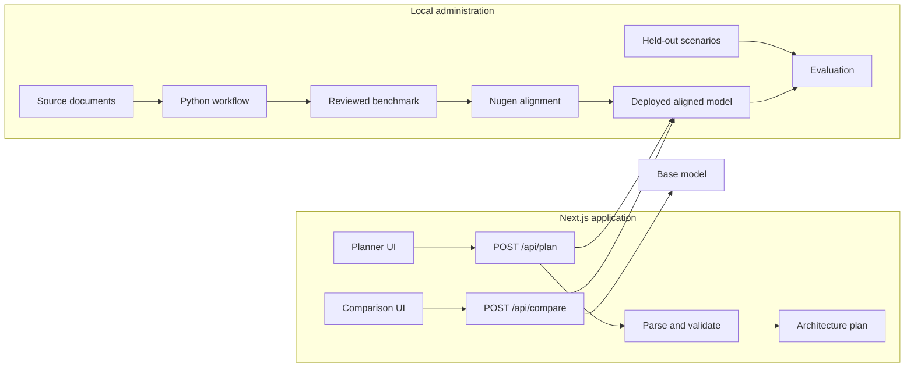

# DomainFit architecture

DomainFit separates model administration from public inference. Python commands prepare documents, manage Nugen alignment, and save resumable state. The Next.js application exposes only planning and comparison inference.

## Trust boundaries

- `NUGEN_API_KEY` is read only in server-side TypeScript and local Python code.
- Public routes cannot create alignments or deployments.
- Alignment and deployment commands require explicit confirmation.
- Model text is treated as untrusted, extracted as JSON, and validated. One corrective retry is allowed.
- Authorization, calculations, schema checks, and approval gates remain deterministic application logic.
- Polling and network requests have explicit limits.

## Persistence

Planner drafts and mock results use browser local storage because the demo has no authentication or database. Administrative workflow IDs use ignored `artifacts/state.json`. Generated, reviewed, held-out, and evaluation artifacts remain separate to prevent accidental benchmark leakage.

